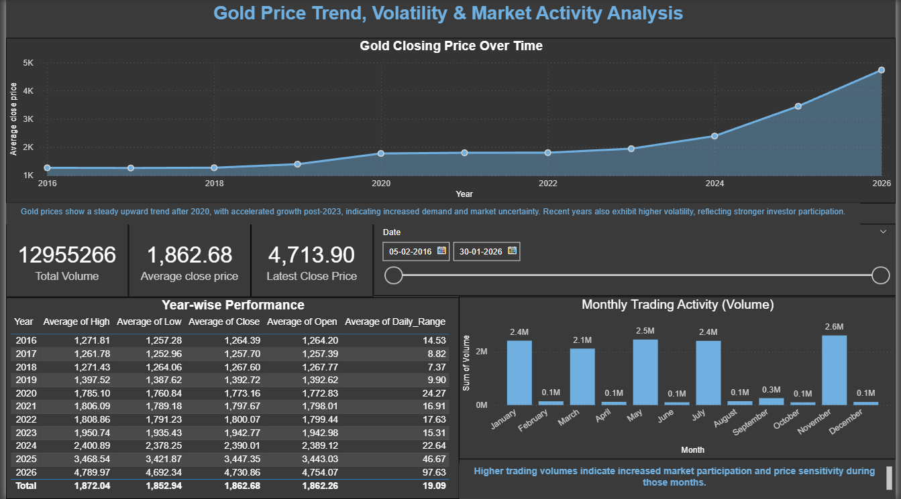

## 📌 Project Overview
This Power BI project analyzes historical gold price data to identify long-term trends, price volatility and trading activity. The dashboard is designed to support market analysis and investment insights.

## 📊 Dataset
- Source: Yahoo Finance
- Frequency: Daily
- Key Columns:
  - Date
  - Open, High, Low, Close, Adjusted Close
  - Volume

## 📈 Key Insights
- Gold prices show a strong upward trend after 2020 with increased volatility.
- Certain months exhibit consistently higher trading activity.
- High trading volumes often coincide with periods of higher price fluctuations.

## 🛠 Tools & Skills Used
- Power BI
- DAX (Time Intelligence, Measures)
- Data Cleaning & Transformation
- Data Visualization & Storytelling

## 📷 Dashboard Preview

✅ Key Learnings
- Database normalization
- SQL joins and aggregations
- Business-focused analysis
- Data visualization best practices

